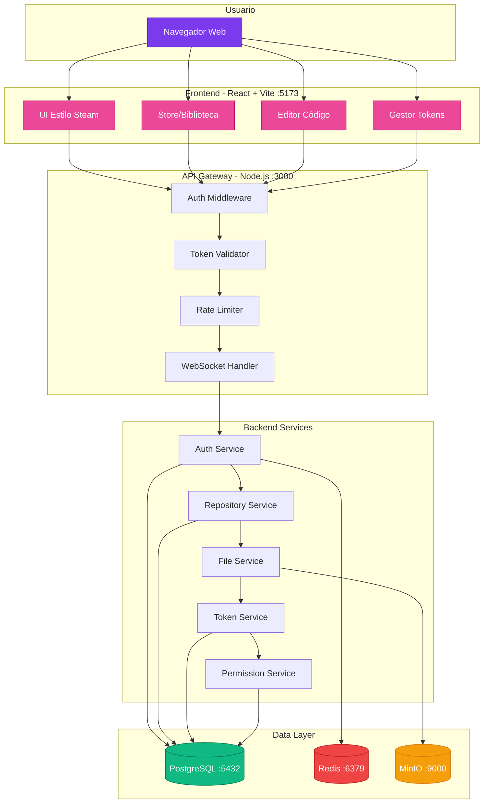

# DevDB - Arquitectura General

```mermaid
graph TB
    subgraph "Usuario"
        A[Navegador Web]
    end

    subgraph "Frontend - React + Vite :5173"
        B[UI Estilo Steam]
        C[Store/Biblioteca]
        D[Editor Código]
        E[Gestor Tokens]
    end

    subgraph "API Gateway - Node.js :3000"
        F[Auth Middleware]
        G[Token Validator]
        H[Rate Limiter]
        I[WebSocket Handler]
    end

    subgraph "Backend Services"
        J[Auth Service]
        K[Repository Service]
        L[File Service]
        M[Token Service]
        N[Permission Service]
    end

    subgraph "Data Layer"
        O[(PostgreSQL :5432)]
        P[(Redis :6379)]
        Q[(MinIO :9000)]
    end

    A --> B
    A --> C
    A --> D
    A --> E
    B --> F
    C --> F
    D --> F
    E --> F
    F --> G
    G --> H
    H --> I
    I --> J
    J --> K
    K --> L
    L --> M
    M --> N
    J --> O
    J --> P
    K --> O
    L --> Q
    M --> O
    N --> O

    style A fill:#7C3AED,stroke:#5B21B6,color:#fff
    style B fill:#EC4899,stroke:#BE185D,color:#fff
    style C fill:#EC4899,stroke:#BE185D,color:#fff
    style D fill:#EC4899,stroke:#BE185D,color:#fff
    style E fill:#EC4899,stroke:#BE185D,color:#fff
    style O fill:#10B981,stroke:#047857,color:#fff
    style P fill:#EF4444,stroke:#B91C1C,color:#fff
    style Q fill:#F59E0B,stroke:#D97706,color:#fff
```
