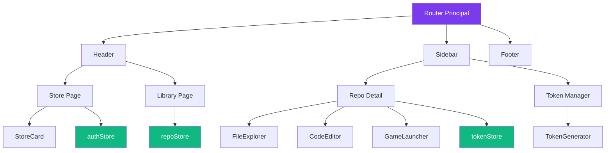

# DevDB - Componentes Frontend

```mermaid
graph TB
    A[Router Principal]
    B[Header]
    C[Sidebar]
    D[Footer]
    E[Store Page]
    F[Library Page]
    G[Repo Detail]
    H[Token Manager]
    I[StoreCard]
    J[FileExplorer]
    K[CodeEditor]
    L[GameLauncher]
    M[TokenGenerator]
    N[authStore]
    O[repoStore]
    P[tokenStore]

    A --> B
    A --> C
    A --> D
    B --> E
    B --> F
    C --> G
    C --> H
    E --> I
    G --> J
    G --> K
    G --> L
    H --> M
    E --> N
    F --> O
    G --> P

    style A fill:#7C3AED,color:#fff
    style N fill:#10B981,color:#fff
    style O fill:#10B981,color:#fff
    style P fill:#10B981,color:#fff
```
