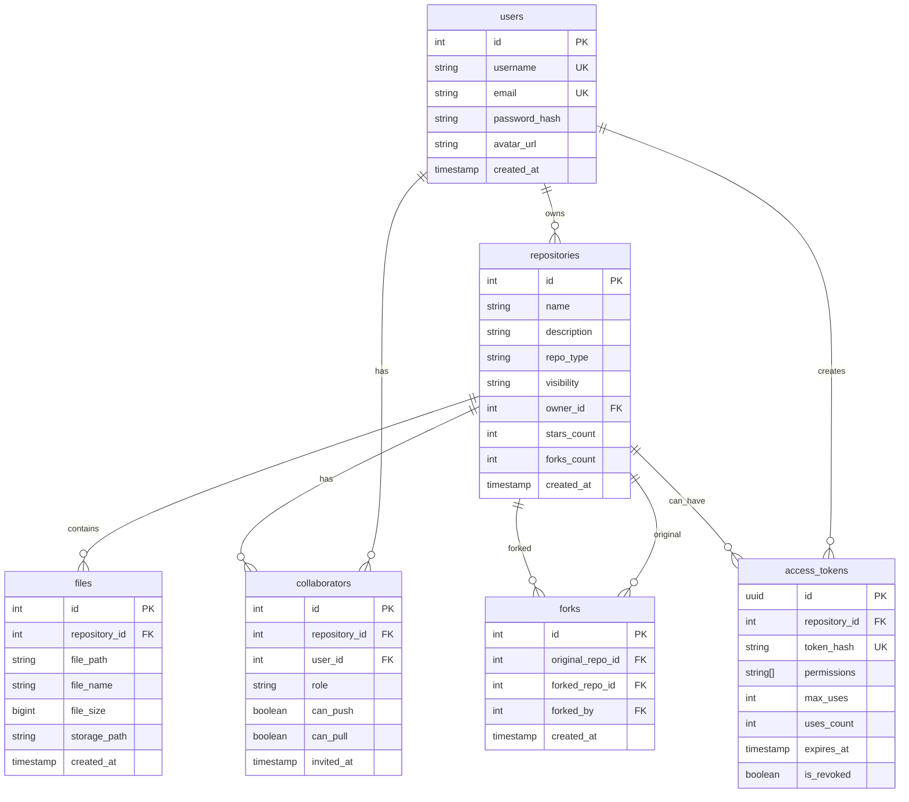

# DevDB - Modelo de Base de Datos

```mermaid
erDiagram
    users ||--o{ repositories : owns
    users ||--o{ collaborators : has
    users ||--o{ access_tokens : creates

    repositories ||--o{ files : contains
    repositories ||--o{ collaborators : has
    repositories ||--o{ access_tokens : can_have
    repositories ||--o{ forks : original
    repositories ||--o{ forks : forked

    repositories {
        int id PK
        string name
        string description
        string repo_type
        string visibility
        int owner_id FK
        int stars_count
        int forks_count
        timestamp created_at
    }

    users {
        int id PK
        string username UK
        string email UK
        string password_hash
        string avatar_url
        timestamp created_at
    }

    files {
        int id PK
        int repository_id FK
        string file_path
        string file_name
        bigint file_size
        string storage_path
        timestamp created_at
    }

    collaborators {
        int id PK
        int repository_id FK
        int user_id FK
        string role
        boolean can_push
        boolean can_pull
        timestamp invited_at
    }

    access_tokens {
        uuid id PK
        int repository_id FK
        string token_hash UK
        string[] permissions
        int max_uses
        int uses_count
        timestamp expires_at
        boolean is_revoked
    }

    forks {
        int id PK
        int original_repo_id FK
        int forked_repo_id FK
        int forked_by FK
        timestamp created_at
    }
```
