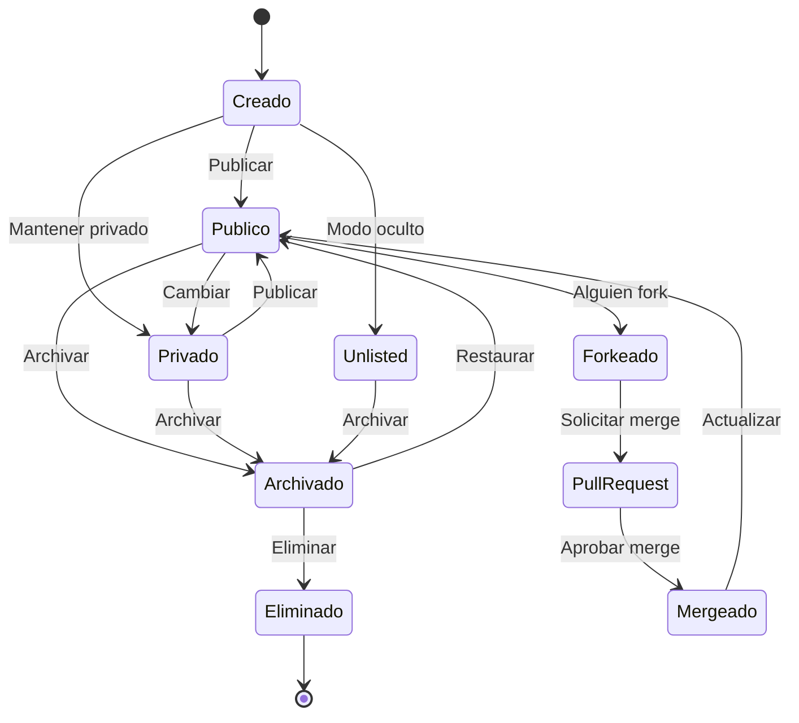

# DevDB - Estados de Repositorio

```mermaid
stateDiagram-v2
    [*] --> Creado
    Creado --> Publico : Publicar
    Creado --> Privado : Mantener privado
    Creado --> Unlisted : Modo oculto
    Publico --> Privado : Cambiar
    Privado --> Publico : Publicar
    Publico --> Archivado : Archivar
    Privado --> Archivado : Archivar
    Unlisted --> Archivado : Archivar
    Archivado --> Eliminado : Eliminar
    Archivado --> Publico : Restaurar
    Publico --> Forkeado : Alguien fork
    Forkeado --> PullRequest : Solicitar merge
    PullRequest --> Mergeado : Aprobar merge
    Mergeado --> Publico : Actualizar
    Eliminado --> [*]
```
