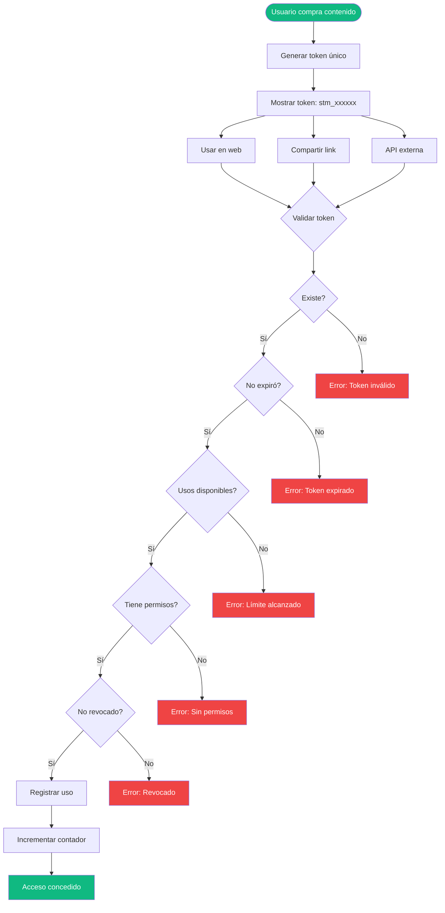

# DevDB - Sistema de Tokens

```mermaid
flowchart TD
    START([Usuario compra contenido])
    GENERATE[Generar token único]
    SHOW[Mostrar token: stm_xxxxxx]
    USE1[Usar en web]
    USE2[Compartir link]
    USE3[API externa]
    VALIDATE{Validar token}
    CHECK_EXISTS{Existe?}
    CHECK_EXPIRED{No expiró?}
    CHECK_USES{Usos disponibles?}
    CHECK_PERMS{Tiene permisos?}
    CHECK_REVOKED{No revocado?}
    LOG[Registrar uso]
    INCREMENT[Incrementar contador]
    GRANT[Acceso concedido]
    ERROR1[Error: Token inválido]
    ERROR2[Error: Token expirado]
    ERROR3[Error: Límite alcanzado]
    ERROR4[Error: Sin permisos]
    ERROR5[Error: Revocado]

    START --> GENERATE
    GENERATE --> SHOW
    SHOW --> USE1
    SHOW --> USE2
    SHOW --> USE3
    USE1 --> VALIDATE
    USE2 --> VALIDATE
    USE3 --> VALIDATE
    VALIDATE --> CHECK_EXISTS
    CHECK_EXISTS -->|No| ERROR1
    CHECK_EXISTS -->|Sí| CHECK_EXPIRED
    CHECK_EXPIRED -->|Sí| CHECK_USES
    CHECK_EXPIRED -->|No| ERROR2
    CHECK_USES -->|Sí| CHECK_PERMS
    CHECK_USES -->|No| ERROR3
    CHECK_PERMS -->|Sí| CHECK_REVOKED
    CHECK_PERMS -->|No| ERROR4
    CHECK_REVOKED -->|Sí| LOG
    CHECK_REVOKED -->|No| ERROR5
    LOG --> INCREMENT
    INCREMENT --> GRANT

    style START fill:#10B981,color:#fff
    style GRANT fill:#10B981,color:#fff
    style ERROR1 fill:#EF4444,color:#fff
    style ERROR2 fill:#EF4444,color:#fff
    style ERROR3 fill:#EF4444,color:#fff
    style ERROR4 fill:#EF4444,color:#fff
    style ERROR5 fill:#EF4444,color:#fff
```
