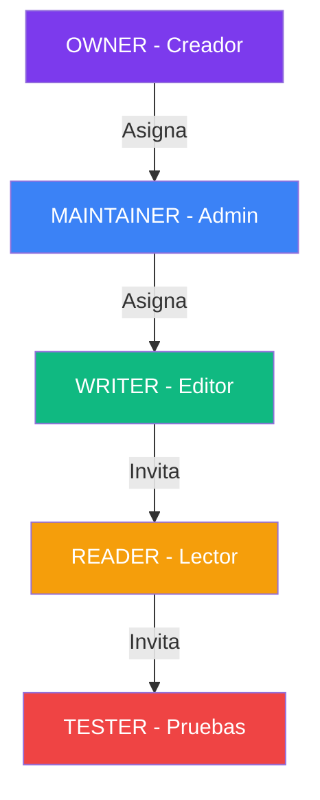

# DevDB - Jerarquía de Roles

```mermaid
flowchart TD
    OWNER[OWNER - Creador]
    MAINTAINER[MAINTAINER - Admin]
    WRITER[WRITER - Editor]
    READER[READER - Lector]
    TESTER[TESTER - Pruebas]

    OWNER -->|Asigna| MAINTAINER
    MAINTAINER -->|Asigna| WRITER
    WRITER -->|Invita| READER
    READER -->|Invita| TESTER

    style OWNER fill:#7C3AED,color:#fff
    style MAINTAINER fill:#3B82F6,color:#fff
    style WRITER fill:#10B981,color:#fff
    style READER fill:#F59E0B,color:#fff
    style TESTER fill:#EF4444,color:#fff
```
