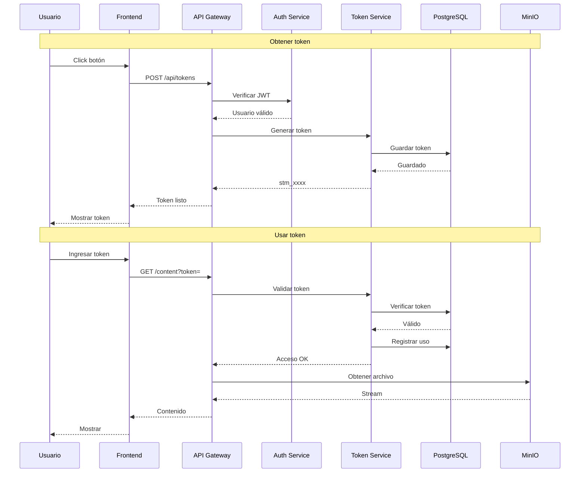

# DevDB - Secuencia de API

```mermaid
sequenceDiagram
    participant U as Usuario
    participant F as Frontend
    participant G as API Gateway
    participant A as Auth Service
    participant T as Token Service
    participant P as PostgreSQL
    participant M as MinIO

    Note over U,M: Obtener token
    U->>F: Click botón
    F->>G: POST /api/tokens
    G->>A: Verificar JWT
    A-->>G: Usuario válido
    G->>T: Generar token
    T->>P: Guardar token
    P-->>T: Guardado
    T-->>G: stm_xxxx
    G-->>F: Token listo
    F-->>U: Mostrar token

    Note over U,M: Usar token
    U->>F: Ingresar token
    F->>G: GET /content?token=
    G->>T: Validar token
    T->>P: Verificar token
    P-->>T: Válido
    T->>P: Registrar uso
    T-->>G: Acceso OK
    G->>M: Obtener archivo
    M-->>G: Stream
    G-->>F: Contenido
    F-->>U: Mostrar
```
