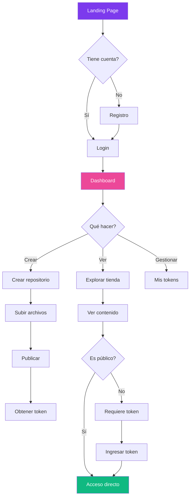

# DevDB - Flujo de Usuario

```mermaid
flowchart TD
    A[Landing Page]
    B{Tiene cuenta?}
    C[Registro]
    D[Login]
    E[Dashboard]
    F{Qué hacer?}
    G[Explorar tienda]
    H[Crear repositorio]
    I[Mis tokens]
    J[Subir archivos]
    K[Publicar]
    L[Obtener token]
    M[Ver contenido]
    N{Es público?}
    O[Acceso directo]
    P[Requiere token]
    Q[Ingresar token]

    A --> B
    B -->|No| C
    B -->|Sí| D
    C --> D
    D --> E
    E --> F
    F -->|Ver| G
    F -->|Crear| H
    F -->|Gestionar| I
    H --> J
    J --> K
    K --> L
    G --> M
    M --> N
    N -->|Sí| O
    N -->|No| P
    P --> Q
    Q --> O

    style A fill:#7C3AED,color:#fff
    style E fill:#EC4899,color:#fff
    style O fill:#10B981,color:#fff
```
